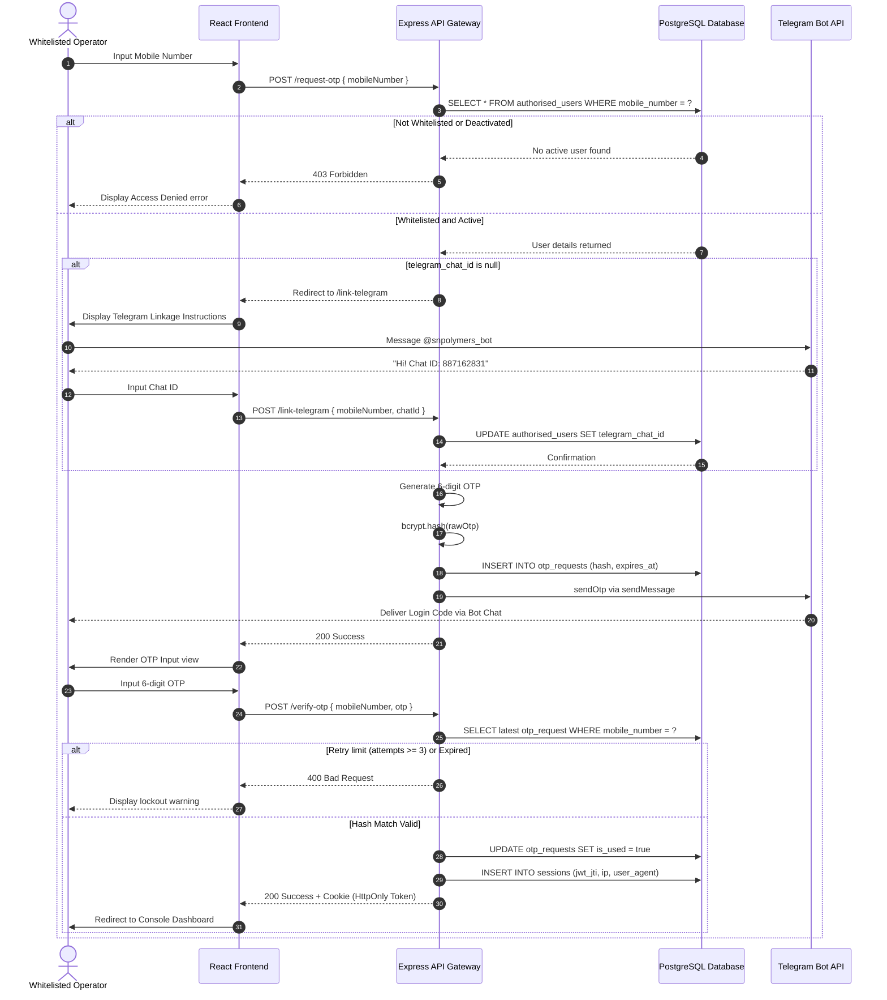
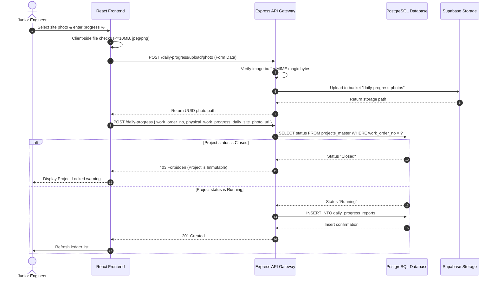

# Part 8: Business Workflows Diagrams
## S.N. Polymers IDBP Operational Flowcharts

This document maps out system actors, sequence flows, database transactions, validation checkpoints, and status transitions.

---

## 1. Authentication Sequence

This workflow describes the OTP authentication sequence, including whitelist checks, Telegram linkage validation, and token issuance:

---

## 2. Daily Site Progress Submission

This workflow outlines the sequence JEs execute to submit cumulative progress metrics:

