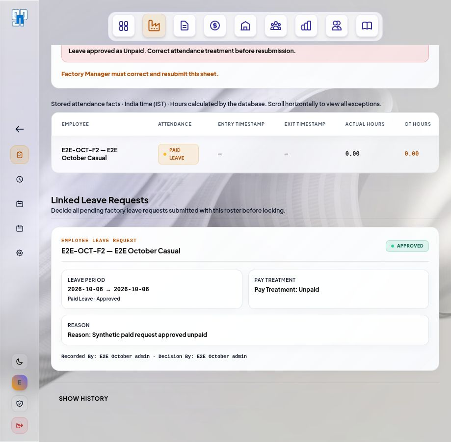
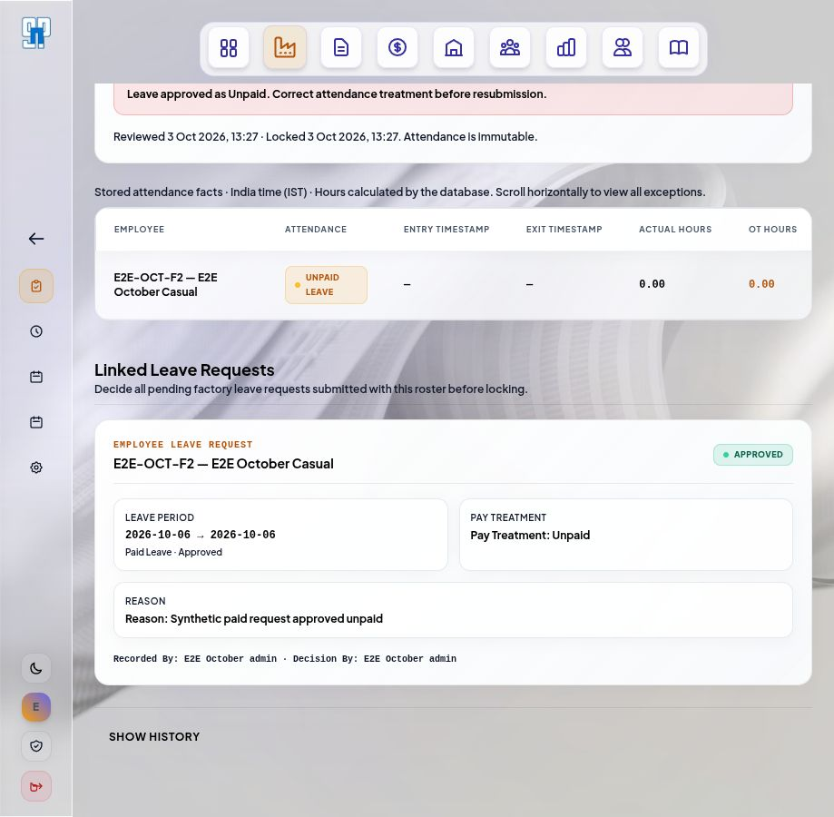
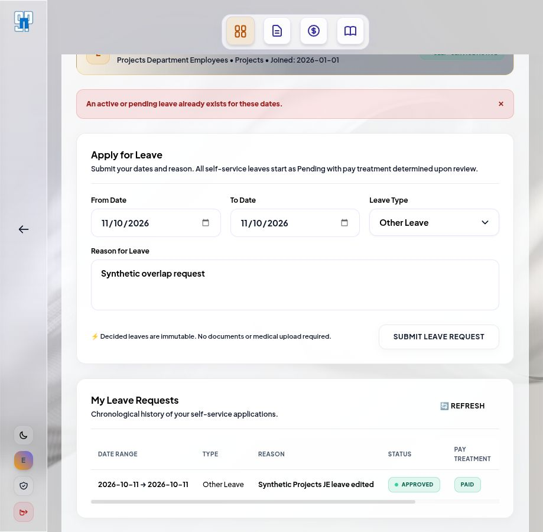

# Attendance and leave local E2E report — 3 October 2026

Tested branch `employee_management`, commit `cf32d20`, against a fresh local Docker Supabase database with all 107 ordered migrations applied. Backend: http://localhost:5000; frontend: http://localhost:5173. Browser: Codex in-app browser. Development OTP: `123456`. Email and Telegram delivery were disabled. All browser mutations used explicitly synthetic employees and accounts.

## Result

The tested attendance submission, factory leave decision/correction, review/lock, and self-service leave workflows passed. No authorization bypass or persistence failure was observed. One reproducible profile UI defect and one documentation/implementation mismatch remain below. Passing tests do not resolve that mismatch.

## Browser role coverage

| Role | Observed result |
| --- | --- |
| Factory Manager | Created drafts, explicitly marked presence, saved overnight and Local Double Duty shifts, recorded medical leave, submitted and corrected/resubmitted rejected leave. HO review direct route denied. Profile Leave Requests produces a context error (finding 1). |
| HO | Reviewed submitted factory category sheets, rejected medical leave with remarks, locked valid overnight attendance, read named audit history, and submitted own linked HO Staff leave. Daily attendance exposed no write controls. |
| Admin | Created and submitted attendance for both permanent categories; approved/rejected staff leave; locked Local duty and corrected sheets; approved factory leave with changed treatment and completed explicit correction/resubmission/lock. Unlinked profile correctly displayed Not Eligible. |
| JE | Linked Projects employee submitted and edited own Pending leave. After approval, ledger showed Approved/Paid and Immutable, with no Edit action. Overlapping request was rejected. Attendance and staff approval direct routes redirected to dashboard. |
| ZO | Linked Projects employee had a personal leave form and empty own ledger. Calendar and staff approval direct routes redirected to dashboard. |
| Accounts | Linked HO Staff employee had a personal leave form and empty own ledger; another employee's requests were absent. Attendance and staff approval direct routes redirected to dashboard. |

ZO and Accounts browser checks exercised eligibility, empty/self-only visibility and route denial; their submission/ownership mutation boundaries were covered by the executed DB/API suites. Factory workers do not require an ERP login under the approved workflow.

## Browser scenarios and persisted outcomes

| Scenario | Result |
| --- | --- |
| Unmarked category sheet submission | Rejected with incomplete attendance/configuration or unresolved leave message. |
| Casual overnight shift, 3 Oct 20:00 to 4 Oct 06:00 IST | Saved 10 actual hours and 2 OT hours; submitted facts froze; HO locked round 1. |
| Local Double Duty, 3 Oct 08:00 to 4 Oct 10:00 IST | Saved 26 actual hours and zero OT; no Local holiday eligibility or Paid Leave option; Admin locked round 1. |
| Casual medical leave, 4 Oct | Pending leave blocked Review & Lock. HO rejection required remarks and returned the sheet while retaining Medical Leave. FM explicitly changed to Absent, saved, resubmitted; Admin locked round 2. |
| Fabric permanent employee, 5 Oct | Compensatory Off saved with blank timestamps and zero hours, then submitted. |
| SNP permanent factory labour, 5 Oct | Full Management Issue stoppage saved with remarks, blank timestamps and zero hours, then submitted. |
| Paid factory request, 6 Oct, approved as Unpaid | Requested type remained Paid Leave; sheet returned and row remained Paid Leave. Admin explicitly selected Unpaid Leave, saved, used the existing approved request, saved, resubmitted, and locked round 2. Final row was Unpaid Leave with Approved/Unpaid request. |
| HO Staff self-service request, 10 Oct | Submitted Pending/Pending; Admin could not reject without remarks; rejection persisted Rejected/Unpaid with decision actor and remarks. |
| Projects JE self-service request, 11 Oct | Submitted, edited while Pending, approved Paid by Admin; employee ledger displayed Immutable; overlapping new request rejected with a clear message. |
| Monthly calendar | Locked day opened detail with full IST dates/seconds, correctly distinguishing overnight dates and showing saved hours. Non-locked sheets were absent (finding 2). |
| Audit | Review and lock were separate named events; submission/edit events named the authenticated FM or Admin. Rejected request/history was preserved after explicit correction. |
| Staff queue All deep link | `status=All` selected All Statuses and displayed Pending/Approved/Rejected requests. |

## Findings

### 1. P2 — Factory Manager profile exposes a leave tab that always fails its context request

Reproduction: sign in as FM, open `/profile?tab=leave`. The page displays **Failed to load employee leave context** and **Retry Leave Context**. Retrying cannot resolve the current authorization boundary: `verifyJwt.js:60–62` excludes `/api/v1/auth/hr/leaves` from FM's module allowlist. `Profile.jsx:71–81` renders Leave Requests for every role. The standalone unlinked Admin profile correctly renders Not Eligible, so this is a concrete FM UI/API mismatch, not a database failure.

Recommendation: render the appropriate unavailable/ineligible state or hide that tab for FM. If FM self-service eligibility is intended, authorize only the specific self-context routes while retaining the approval queue restriction.

### 2. Contract mismatch — monthly calendar is a locked register rather than the documented correction view

During the browser run, 4 October's Submitted/Returned sheet was shown as an empty dot while 3 October's Locked sheet appeared. The controller explicitly filters `status = Locked` (`hrAttendance.controller.js:44–49`), and the current regression suite asserts this behavior. The approved business MD describes the monthly calendar as a review/correction view (`SN_Polymers_Factory_Attendance_Leave_Business_Rules_Workflow_Final.md:97–115`), and the page says users can open daily sheets for corrections.

This may be an intentional newer product decision, but no matching explanation was found in the current attendance/leave MD files. Confirm and document the intended calendar scope. If the documented correction workflow remains required, show Draft/Submitted/Returned states and their cells; if Locked-only is intended, describe the page as a finalized register and direct corrections to Daily Attendance/returned-sheet navigation.

## Executed automated verification

- Backend local Docker DB/API: **5 files, 74 tests passed** — `hrAttendanceLeave`, `hrAttendanceApi`, `hrAttendanceReview`, `hrAttendanceCalendar`, `hrSelfServiceLeave` regression suites. These exercise role matrices, self-only ownership, inactive/factory/unlinked eligibility, timestamp calculations, Local rules, overlap guards, changed approval treatment, immutable decisions/locked sheets, concurrency, privilege boundaries and audit rollback.
- Frontend focused: **5 files, 49 tests passed** — Daily Attendance, Attendance Review, Monthly Calendar, Staff Leave Queue and Profile Leave Section.
- Fresh database migration application: **107 applied successfully**.
- Browser mutations were read back from the local database; snapshot saved in the evidence folder.

No production build, full repository suite or payroll calculation was run for this test-only request. Error/retry UI received focused automated coverage; network failures were not injected into the live browser.

## Evidence and local inspection

Evidence folder: `documentation/e2e-evidence/attendance-leave-2026-10-03/` contains screenshots, database outcomes and the frontend test log.

Docker and both servers are left running for inspection. The browser is left on the corrected, Locked factory leave sheet as synthetic Admin. The local synthetic accounts remain active:

| Role | Local test mobile |
| --- | --- |
| Admin | 9800003100 |
| Factory Manager | 9800003101 |
| HO | 9800003102 |
| JE | 9800003103 |
| ZO | 9800003104 |
| Accounts | 9800003105 |

Use OTP `123456`. Test accounts, employee records and audit history exist only in local Docker. Automated regression fixtures also remain in that local database. Existing source/config/graph changes were preserved; no application code was changed and no commit or push was made.

## Fix verification — 3 October 2026

Both findings above are resolved in the working tree:

- Factory Manager profiles hide Leave Requests. Legacy `?tab=leave` shows an unavailable message with an attendance link; `?tab=all` does not mount the leave section. Backend permissions remain enforced.
- Monthly calendar includes Draft, Submitted, Returned for Correction and Locked sheets. D/S/R/L markers and a state legend distinguish provisional records from finalized Locked attendance. Unmarked rows show `-` and explain “Unmarked”; missing sheets remain distinct. Cell details retain the daily-sheet link and existing permissions.

Verification: 23 local Docker database regression tests passed (calendar and attendance API), including all role gates, four sheet states and more than 1,000 rows. 51 frontend tests passed (Profile, Calendar, Daily Attendance, Attendance Review); changed frontend files pass ESLint and the frontend production build passes. No migration was needed.

Browser follow-up as synthetic Factory Manager: dev OTP login; legacy profile leave URL; create Draft; inspect unmarked calendar cell; open editable daily sheet; save Absent and submit; inspect Submitted calendar marker. Screenshots: `fixed-fm-profile.jpg`, `fixed-draft-calendar.jpg`, `fixed-submitted-calendar.jpg` in the evidence folder. Returned/Locked coverage was verified in automated tests; those paths were not repeated in the follow-up browser run.

The test harness stopped Supabase with `--no-backup`, removing the previous disposable fixtures. The local schema and six synthetic role accounts/employees were recreated. Earlier screenshots and database-results.json are historical evidence, not a snapshot of the current local database. Current browser fixture is Fabric category, 2026-10-03, Submitted Absent. Docker and both servers are running; browser is on that calendar as Factory Manager. No commit or push was made.
