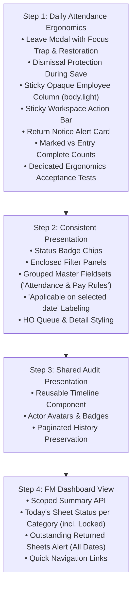

# Factory Manager UI/UX Audit & Reviewed Implementation Plan

## Executive Summary

A comprehensive design review of the **Factory Manager (FM)** module reveals that while the underlying business logic, state machines, and transactional constraints are robust, the frontend interface currently resembles an **early functional prototype / internal debug tool** rather than a polished, state-of-the-art enterprise ERP console.

In stark contrast to the rest of the SN Polymers web application (which employs a sleek glassmorphic design system with `.glass-panel`, KPI metric cards, rich badge chips, interactive charts, and clear visual hierarchy), the Factory Manager pages suffer from:
1. **Severe text loading**: Data and metadata are rendered as raw text strings concatenated with `·`, bullet points, and manual `<br />` tags.
2. **Missing visual boundaries & cards**: Controls, filters, forms, and alerts float in uncontained whitespace without structured card wrappers or background contrast.
3. **Ergonomic table fatigue**: The attendance sheet table spans an extreme width (`min-w-[1650px]`) with raw text inputs and nested paragraphs crammed into cells, forcing exhaustive horizontal scrolling.
4. **Disjointed workflow ergonomics**: Critical secondary flows (such as recording a leave request) render as inline forms tacked onto the bottom of a 50+ row table rather than utilizing focused modals.
5. **A neglected Dashboard**: The FM dashboard view consists of literally two bare text boxes with no KPI metrics, shift status, or quick actions.

---

## Approved Tightened Scope & Architectural Guardrails

Following senior developer review, the scope of the revamp has been tightened to prioritize **practical daily entry ergonomics and layout clarity** over cosmetic fluff:

| Area | Reviewed Direction & Invariants |
| :--- | :--- |
| **Panels, badges, grouped controls** | Reuse existing shared components (`Badge`, `Table`, `Input`, `Select`). Support both Dark and Light themes. **Do not use non-existent `light:` Tailwind classes**; use scoped `body.light` CSS rules consistent with `tailwind.config.js` and `index.css`. Prioritize readable contrast over heavy glass effects. |
| **Sticky employee column** | **High Priority**. Pin the employee identity column on horizontal scroll. **Must have an opaque, theme-aware background** (`.sticky-col-opaque` with `#0b0f19` in dark mode and solid `#ffffff` under `body.light`) so scrolling cells (timestamps, hours, dropdowns) cannot show through. |
| **Leave modal** | **High Priority**. Replace the bottom-of-page inline form with a dedicated `<Modal>` dialog. Preserve dirty-state guards (cannot open while sheet has unsaved edits). **Implement explicit dismissal protections**: prevent Escape, backdrop, and close-button dismissal while saving; protect changed form values from accidental dismissal. Add complete focus trapping on open and focus restoration to the triggering button on close, with proper dialog semantics (`role="dialog"`, `aria-modal="true"`, `aria-labelledby`). |
| **Sticky action bar** | Pin within the attendance workspace container (not fixed to the browser viewport) to prevent collisions with the bottom app dock or mobile drawer. |
| **Timestamps & overnight duty** | Keep full datetime entry visible, including explicit next-day exits. **Standard Duty Hours does not define a start time**, so do NOT add fake "Standard Shift" start-time presets. Never silently fill attendance facts. |
| **Summary tiles & progress** | Distinguish **Marked Count** (attendance status chosen) from **Entry Complete Count** (rows meeting complete frontend entry requirements). Keep hours server-owned and visibly labeled as **"Saved OT Hours"** with a stale indicator (`● Save to recalculate hours`) when draft edits exist. |
| **Master configuration cards** | Label explicitly as **"Applicable on selected date: DD/MM/YYYY"**, preserving effective-dated applicability rather than implying a globally active revision. Keep the master tab named **"Attendance & Pay Rules"** (not "Pay & Shift Rules"). |
| **Dashboard KPIs & Shift entity** | Bounded as a separate step (Step 4). Include `Locked` alongside `Draft`, `Submitted`, `Returned for Correction`, and `Not Created`. Specify that "today" uses `Asia/Kolkata` time and that the returned-sheet count includes outstanding corrections across dates. |

---

## Spot-by-Spot UX Defect Catalogue

### Spot 1: The Factory Manager Dashboard (`/dashboard`)

```
+-------------------------------------------------------------------------------+
| CURRENT IMPLEMENTATION:                                                       |
|                                                                               |
|  Authorized Operator Session                                                  |
|  Welcome back, Factory Manager!                                               |
|  Select a sub-module from the navigation rails or view key details below.     |
|  ---------------------------------------------------------------------------  |
|  +-----------------------------------+  +-----------------------------------+ |
|  | Daily Attendance                  |  | Factory Masters                   | |
|  +-----------------------------------+  +-----------------------------------+ |
+-------------------------------------------------------------------------------+
```

* **File:** [`frontend/src/pages/Dashboard.jsx:25`](file:///home/zenoguy/Desktop/projects/SNPolymers/frontend/src/pages/Dashboard.jsx#L25)
* **What looks bare-bones / bad UX:**
  - Literally two plain clickable boxes with the words "Daily Attendance" and "Factory Masters" inside `<div className="grid md:grid-cols-2 gap-4">`.
  - While every other role (`HO`, `ZO`, `JE`, `Accounts`, `Staff`) has a rich dedicated dashboard view (`HoDashboardView`, `AcctDashboardView`, etc.) complete with KPI tiles, pending queue counts, balance summaries, and visual indicators, the Factory Manager receives zero operational context.
* **Bounded Enhancement (Step 4):**
  - Create [`FmDashboardView.jsx`](file:///home/zenoguy/Desktop/projects/SNPolymers/frontend/src/pages/dashboard/FmDashboardView.jsx) backed by a narrow FM-scoped summary query.
  - Displays category-wise sheet status for today (using `Asia/Kolkata` business date): `Draft`, `Submitted`, `Returned for Correction`, `Locked`, or `Not Created`.
  - Displays total count of outstanding returned sheets requiring FM correction across all dates.
  - Direct quick navigation links to open the respective category sheet.

---

### Spot 2: Daily Attendance Header & Filter Bar (`/factory-attendance`)

```
+-------------------------------------------------------------------------------+
| CURRENT IMPLEMENTATION:                                                       |
|                                                                               |
|  Daily Attendance                                                             |
|  [ Employee Category (Select) ]      [ Attendance Date (Date Input) ]         |
|  Save or discard changes before switching date/category. (plain amber text)   |
|  All timestamps use India time (Asia/Kolkata)... (plain text paragraph)       |
+-------------------------------------------------------------------------------+
```

* **File:** [`frontend/src/pages/hr/DailyAttendance.jsx:15-35`](file:///home/zenoguy/Desktop/projects/SNPolymers/frontend/src/pages/hr/DailyAttendance.jsx#L15-L35)
* **What looks bare-bones / bad UX:**
  - Missing kicker tag and muted subtitle.
  - Category and Date inputs float loosely on the page background without a container panel.
  - Warning messages (`Save or discard changes...`) are unstyled floating text strings.
* **Bounded Enhancement:**
  - Wrap controls in an enclosed panel card (`p-5 rounded-2xl border border-white/10 bg-slate-900/60`).
  - Add standard kicker breadcrumb: `Factory Operations · Attendance Roster`.
  - Display warnings in a structured alert banner with an animated indicator dot.

---

### Spot 3: Sheet Status & Metadata Container (`/factory-attendance`)

```
+-------------------------------------------------------------------------------+
| CURRENT IMPLEMENTATION:                                                       |
|                                                                               |
|  +-------------------------------------------------------------------------+  |
|  | Sheet status: Draft · Submissions: 0 · Roster: 42                       |  |
|  | Standard Duty Hours on saved rows: 12                                   |  |
|  | Last return remarks: Please check Local worker overtime                 |  |
|  | HO remarks: Verified                                                    |  |
|  +-------------------------------------------------------------------------+  |
+-------------------------------------------------------------------------------+
```

* **File:** [`frontend/src/pages/hr/DailyAttendance.jsx:82-95`](file:///home/zenoguy/Desktop/projects/SNPolymers/frontend/src/pages/hr/DailyAttendance.jsx#L82-L95)
* **What looks bare-bones / bad UX:**
  - Unstyled box with raw text concatenation (`Sheet status: <strong>{sheet.status}</strong> · Submissions: ...`).
  - No visual distinction between marked rows and entry-complete rows.
  - Return remarks from HO are dumped as a plain amber paragraph.
* **Bounded Enhancement:**
  - Convert into an Executive Status Banner:
    - Status Badge: `<Badge variant={statusVariant} pulseDot={isDraft}>` (`Draft`, `Submitted`, `Returned for Correction`, `Locked`).
    - Metric Pills: Total Roster, **Marked Count** (status chosen), **Entry Complete Count** (rows meeting frontend completeness: working rows have timestamps + Local duty type; leave rows have linked leave), and **Saved OT Hours** (server-calculated hours).
    - Return Notice Callout: If `return_remarks` exists, render a high-contrast Alert Card (`border-amber-500/30 bg-amber-500/10 text-amber-300`) with an alert icon and exact HO notes.

---

### Spot 4: Action Toolbar Hierarchy (`/factory-attendance`)

```
+-------------------------------------------------------------------------------+
| CURRENT IMPLEMENTATION:                                                       |
|                                                                               |
|  [ Refresh Roster ]  [ Mark All Present ]  [ Save Draft ]  [ Discard Changes ]  [ Submit to HO ]
|  Mark All Present marks unmarked rows only... (plain text)                    |
+-------------------------------------------------------------------------------+
```

* **File:** [`frontend/src/pages/hr/DailyAttendance.jsx:92-108`](file:///home/zenoguy/Desktop/projects/SNPolymers/frontend/src/pages/hr/DailyAttendance.jsx#L92-L108)
* **What looks bare-bones / bad UX:**
  - Actions sit in a flat row with no separation between safe draft saves and irreversible submissions.
  - Buttons disappear offscreen when scrolling through 40+ rows.
* **Bounded Enhancement:**
  - Pin the action toolbar within the table workspace container (`sticky top-2 z-20`) without fixed viewport positioning.
  - Group functionally:
    - Left: Bulk helpers (`Mark All Present`, `Refresh Roster`).
    - Right: Draft & Submit (`Discard Changes`, `Save Draft` [amber], `Submit to HO` [emerald]).
    - Include dirty indicator pill: `● Unsaved changes`.

---

### Spot 5: The 1650px Attendance Table Ergonomics (`/factory-attendance`)

```
+----------------------------------------------------------------------------------------------------------------------------------+
| Employee            | Status         | Entry Timestamp          | Exit Timestamp           | Actual | OT   | Duty | Leave | Remarks |
|---------------------+----------------+--------------------------+--------------------------+--------+------+------+-------+---------|
| John Doe            | [ Present  v ] | [ 2026-09-30T08:00:00  ] | [ 2026-09-30T20:00:00  ] | 12.00  | 0.00 | [v]  | [Btn] | [     ] |
| EMP-001             |                |                          |                          |        |      |      |       |         |
| Active              |                |                          |                          |        |      |      |       |         |
+----------------------------------------------------------------------------------------------------------------------------------+
```

* **File:** [`frontend/src/pages/hr/DailyAttendance.jsx:110-145`](file:///home/zenoguy/Desktop/projects/SNPolymers/frontend/src/pages/hr/DailyAttendance.jsx#L110-L145)
* **What looks bare-bones / bad UX:**
  - Table is `min-w-[1650px]` causing extreme horizontal scrolling.
  - Employee info is rendered as stacked text with raw `<br/>` tags.
  - Horizontal scrolling hides the employee name when viewing duty/leave/remarks.
  - Actual & OT hours are plain numbers without monospace alignment or units.
  - Leave cell contains a multi-line paragraph text dump with squeezed buttons.
* **Bounded Enhancement:**
  - **Sticky Opaque Employee Column**: Pin `left-0 z-10` using `.sticky-col-opaque` (`#0b0f19` in dark mode, solid `#ffffff` under `body.light`, with theme-aware borders) to completely block underlying scrolling content.
  - **Structured Employee Cell**: Avatar initials circle, bold name, monospace `EMP-XXX` code chip, active status dot.
  - **Monospace Hours**: Display with units (`12.00 hrs`), amber badge when OT > 0 (`+2.50 hrs OT`), and clear `● Save to recalculate hours` stale notice when row has unsaved edits.
  - **Compact Leave Chip**: Render compact badge `[ 🟡 Medical Leave ]` with click-to-view/edit in Modal instead of paragraph text walls.

---

### Spot 6: Inline Leave Form Location & Dialog Semantics (`LeaveForm`)

```
+-------------------------------------------------------------------------------+
| CURRENT IMPLEMENTATION:                                                       |
|                                                                               |
|  [ ... 45 Rows of Table Data ... ]                                            |
|                                                                               |
|  +-------------------------------------------------------------------------+  |
|  | Factory Leave — John Doe                                                |  |
|  | Saving records this range request and links this attendance row...       |  |
|  | [ From Date ] [ To Date ] [ Leave Type ] [ Pay Treatment ] [ Reason ]   |  |
|  | [ Save Leave ]  [ Cancel Leave Entry ]                                  |  |
|  +-------------------------------------------------------------------------+  |
+-------------------------------------------------------------------------------+
```

* **File:** [`frontend/src/pages/hr/DailyAttendance.jsx:150-170`](file:///home/zenoguy/Desktop/projects/SNPolymers/frontend/src/pages/hr/DailyAttendance.jsx#L150-L170)
* **What looks bare-bones / bad UX:**
  - Renders inline at the bottom of the page beneath the entire 1650px table, losing all visual context of the employee row.
* **Bounded Enhancement:**
  - Mount inside the shared [`Modal`](file:///home/zenoguy/Desktop/projects/SNPolymers/frontend/src/components/ui/Modal.jsx) component (`isOpen={Boolean(leaveEmployee)}`).
  - **Dismissal & Mutation Protections**:
    - Escape key, backdrop click, and close-button are completely disabled while save mutation is `pending`.
    - Protect changed leave-form values: if the user modified form inputs, warn or require explicit cancel before closing to prevent accidental loss.
    - On database rejection (e.g. overlapping leave conflict), the modal remains open with form values intact and the error alert displayed.
  - **Keyboard & Focus Management**:
    - Auto-focus the first interactive field (`From Date`) on open.
    - Trap keyboard focus within the dialog container.
    - Return focus to the triggering `Record Leave` or `Edit Leave` button upon close.
    - Provide complete dialog semantics: `role="dialog"`, `aria-modal="true"`, `aria-labelledby="leave-modal-title"`.

---

### Spot 7: Factory Masters Layout (`/factory-masters`)

* **File:** [`frontend/src/pages/hr/FactoryMasters.jsx`](file:///home/zenoguy/Desktop/projects/SNPolymers/frontend/src/pages/hr/FactoryMasters.jsx)
* **What looks bare-bones / bad UX:**
  - Tab navigation uses raw primary/secondary buttons.
  - Applicable rule display is a string concatenation sentence: `Applicable wage: ₹550 from 2026-09-01...`.
  - Revision form is a monolithic 10-input grid without functional grouping.
* **Bounded Enhancement (Step 2):**
  - Clean pill tabs: **"Daily Wage Master"** and **"Attendance & Pay Rules"** (exact naming).
  - Config card labeled explicitly: **"Applicable on selected date: DD/MM/YYYY"** with clear key-value stats (Standard Hours, OT Method, Double Duty Multiplier).
  - Form grouped into 3 distinct fieldsets: *Effective Period & Base Hours*, *Overtime & Multipliers*, and *Stoppage Policies*.

---

### Spot 8: HO Review Queue & Detail (`/factory-attendance/review`)

* **Files:** [`AttendanceReviewQueue.jsx`](file:///home/zenoguy/Desktop/projects/SNPolymers/frontend/src/pages/hr/AttendanceReviewQueue.jsx), [`AttendanceReviewDetail.jsx`](file:///home/zenoguy/Desktop/projects/SNPolymers/frontend/src/pages/hr/AttendanceReviewDetail.jsx)
* **What looks bare-bones / bad UX:**
  - Loose filter inputs without container panel.
  - Status column is raw text instead of `<Badge>` chips.
  - Detail page has 7-line stacked `<p>` tag metadata dump and raw text leave decision boxes.
* **Bounded Enhancement (Step 2):**
  - Queue: Enclosed filter panel, color-coded review status badges, styled "Open Sheet" action button.
  - Detail: Structured header card, clean leave decision cards with side-by-side pay treatment select and approve/reject buttons, and structured return remarks input.

---

## Phased Implementation Sequence



---

## Step 1 Detailed Implementation Specification

### 1. Leave Modal Dialog & Accessibility Management
* Wrap `LeaveForm` in `<Modal>`:
  - `role="dialog"`, `aria-modal="true"`, `aria-labelledby="factory-leave-modal-title"`.
  - When `mutation.isPending` is true:
    - Overlay click does nothing (`closeOnOverlayClick={false}`).
    - Escape key handler is disabled.
    - Close button is disabled.
  - If user has modified any form field:
    - Attempting to dismiss via Escape or backdrop prompts confirmation (`"Discard unsaved leave entry?"`) or requires clicking "Cancel Leave Entry".
  - **Focus Trap & Restoration**:
    - A `triggerButtonRef` stores the DOM element that opened the modal (`Record Leave` or `Edit Leave` button).
    - When modal mounts, focus moves automatically to the `From Date` input.
    - When modal unmounts, focus returns to `triggerButtonRef.current?.focus()`.
    - Tab and Shift-Tab cycle exclusively through focusable elements inside the modal.

### 2. Sticky Opaque Employee Column
* Add `.sticky-col-opaque` in [`frontend/src/index.css`](file:///home/zenoguy/Desktop/projects/SNPolymers/frontend/src/index.css):
  ```css
  .sticky-col-opaque {
    background-color: #0b0f19;
    border-right: 1px solid rgba(255, 255, 255, 0.1);
  }
  body.light .sticky-col-opaque {
    background-color: #ffffff !important;
    border-right: 1px solid #e2e8f0 !important;
  }
  ```
* Apply `sticky left-0 z-10 sticky-col-opaque` to the `Employee` `TableCell` in both header and body rows.
* Guarantees 100% true opacity in both Dark and Light themes with zero bleed-through during horizontal scroll.

### 3. Summary Banner & Status Counts
* Replaces the unstyled string box with a structured grid card:
  - **Sheet Status Badge**: `<Badge variant={...}>` (`Draft`, `Submitted`, `Returned for Correction`, `Locked`).
  - **Headcount Metrics**:
    - `Total Roster`: Count of all rows in sheet.
    - `Marked`: Count of rows with non-empty `attendance_status`.
    - `Entry Complete`: Count of rows satisfying frontend entry completeness (working rows have timestamps + Local duty type; leave rows have linked leave; non-working rows have no timestamps).
    - **Saved OT Hours**: Displayed as e.g. `14.50 hrs`. When `dirty` is true, displays inline amber stale indicator: `● Save to recalculate hours`.
  - **Return Remarks Banner**: If `sheet.return_remarks` exists, renders a high-contrast Alert Card (`border-amber-500/30 bg-amber-500/10 text-amber-300`) with alert icon.

### 4. Workspace Action Bar
* Contained inside the attendance table card with `sticky top-2 z-20`:
  - Does not use fixed viewport positioning, preventing overlap with the dock or mobile drawer.
  - Left group: `Refresh Roster` / `Create Attendance Sheet`, `Mark All Present` (with unmarked count badge).
  - Right group: `Discard Changes` (secondary), `Save Draft` (amber), `Submit to HO` / `Resubmit to HO` (emerald).
  - Dirty indicator badge: `● Unsaved changes`.

---

## Step 1 Acceptance Criteria & Dedicated Tests

In addition to keeping all existing regression suites 100% green, Step 1 introduces explicit tests in [`DailyAttendance.test.jsx`](file:///home/zenoguy/Desktop/projects/SNPolymers/frontend/src/pages/hr/DailyAttendance.test.jsx) verifying:

1. **Leave Modal Accessibility & Focus Restoration**:
   - Clicking `Record Leave` opens the modal with `role="dialog"` and focuses the `From Date` input.
   - Closing the modal via `Cancel Leave Entry` returns focus to the `Record Leave` button.
2. **Leave Modal Dismissal Protections**:
   - While `saveFactoryLeave` is in-flight (`pending`), pressing Escape or clicking backdrop does NOT dismiss the modal.
   - When `saveFactoryLeave` rejects with a conflict error (409), the modal remains open with user-entered values intact and error alert displayed.
3. **Dirty-State Dismissal Guard**:
   - If form inputs are modified, accidental dismissal is prevented until explicit cancel.
4. **Sticky Column Opacity & Classes**:
   - Verifies the Employee table cell has `.sticky-col-opaque` and `sticky left-0 z-10`.
   - Verified against `body.light` styling.
5. **Entry Complete vs. Marked Counters**:
   - Verifies that marking a row `Present` without timestamps increments `Marked Count` but NOT `Entry Complete Count`.
   - Adding valid timestamps increments `Entry Complete Count`.
6. **Saved OT Hours Labeling**:
   - Verifies OT hours summary is labeled **"Saved OT Hours"** and displays `Save to recalculate hours` when rows are modified in draft.
7. **Zero API / Regression Breakages**:
   - `DailyAttendance.integration.test.jsx` passes completely.
   - Full test run against Supabase backend passes completely.

---

## Step 2 Detailed Implementation Specification & Acceptance Results

### 1. Factory Masters (`/factory-masters`)
* **Pill Tabs Switcher**:
  - Enclosed pill container (`flex items-center gap-2 p-1.5 rounded-2xl bg-white/5 border border-white/10 w-fit`).
  - Strict naming preserved: **"Daily Wage Master"** and **"Attendance & Pay Rules"**.
  - Dynamic authoritative page title: `Factory Labour Wage Master` vs. `Factory Attendance & Pay Rule Master`.
* **Enclosed Filter Panel**:
  - Encapsulated within `.glass-panel` container with responsive grid layout for Category and Applicable Date.
* **Effective Policy Snapshot Card**:
  - Explicitly labeled: `Applicable on selected date: YYYY-MM-DD` with category badge chip.
  - Multi-column metric card grid for Applicable Wage, Standard Duty Hours, Overtime Policy, Double Duty Multiplier, Holiday Pay Rule, and Management Stoppage Policy.
  - Cross-tab maintenance notice retained: `Maintained in Pay Rule Master.`
* **Grouped Revision Form**:
  - Form encapsulated in `.glass-panel` with 3 semantic `<fieldset>` divisions:
    1. *Section 1: Effective Period & Base Hours*
    2. *Section 2: Overtime & Multipliers*
    3. *Section 3: Stoppage Policies*
  - Proper disabling during mutations with `Saving…` state feedback.
* **Revision History Table**:
  - Status column replaced with `<Badge>` chips (`Active` -> emerald, `Scheduled` -> blue, `Superseded` / `Historical` -> slate).

### 2. HO Review Queue (`/factory-attendance/review`)
* Enclosed filter panel in `.glass-panel` with responsive 4-column layout for From Date, To Date, Category, and Review Status.
* Status column renders color-coded `<Badge>` chips (`Submitted` -> amber, `Returned for Correction` -> red, `Locked` -> emerald).
* Replaced plain text link with styled `Open Sheet` action button.

### 3. HO Review Detail (`/factory-attendance/review/:sheetId`)
* Enclosed header summary panel with Status badge chip, Submission Round, named Submitter with IST timestamp, Headcount, and Total Saved OT hours.
* Redesigned `LeaveDecision` cards into distinct `.glass-panel` sections with approval status badge, leave duration tile, pay treatment tile, reason callout, and side-by-side decision inputs and action buttons.
* Structured Return and Review & Lock action section with mandatory return remarks validation.

### 4. Step 2 Dedicated Acceptance Tests
* `FactoryMasters.test.jsx`: Added acceptance test verifying exact pill tab names, explicit applicable date snapshot card, and the 3 distinct rule fieldset headings.
* `AttendanceReview.test.jsx`: Added acceptance test verifying styled status badge chips in queue and structured header summary cards in detail.
* All 42 HR frontend tests, 61 App route tests, and 41 backend regression tests pass 100%.

---

## Step 3 Detailed Implementation Specification & Acceptance Results

### 1. Reusable Sheet Audit Timeline (`frontend/src/components/hr/SheetAuditTimeline.jsx`)
* **Visual Audit Node Design**:
  - Continuous vertical connecting line (`w-0.5 bg-white/10`) linking chronologically ordered audit milestones.
  - Color-coded circular action nodes (emerald for `SHEET_LOCKED` / `LEAVE_APPROVED`, amber for `SHEET_SUBMITTED`, red for `SHEET_RETURNED` / `LEAVE_REJECTED`, sky blue for review and creation events).
  - Actor initials avatar badge circle with dynamic fallback.
  - Color-coded `<Badge>` for action classification.
  - Guaranteed exact combined string formatting: `<span className="text-xs font-semibold text-slate-200">{event.action} · {event.user_name}</span>` to maintain 100% backward compatibility with existing test assertions (`/SHEET_SUBMITTED · Factory Operator/`).
* **Timestamp Formatting**:
  - Formatted strictly in India Standard Time (`Asia/Kolkata`) with `timeZone: 'Asia/Kolkata'` using `Intl.DateTimeFormat`.
* **Structured Remarks Block**:
  - Distinct blockquote callout with left accent bar for submission remarks, return reasons, and approval notes.
* **Timeline Pagination**:
  - Configurable page size (default: 5 events per page) with Previous/Next controls, active page counter, and total event tally.
* **Component States**:
  - Empty state with standard text: `No history for this sheet.`
  - Loading skeleton state with `role="status"`.
  - Error state with retry callback button.

### 2. Integration Across Factory Attendance Views
* **Daily Attendance History Modal** (`frontend/src/pages/hr/DailyAttendance.jsx`):
  - Refactored `SheetHistory` modal body to delegate to `<SheetAuditTimeline />`.
  - Preserved existing query hooks (`useSheetHistory`) and modal trigger contract.
* **HO Review Detail Audit Sign-off** (`frontend/src/pages/hr/AttendanceReviewDetail.jsx`):
  - Replaced plain bullet list with enclosed `<SheetAuditTimeline />`.
  - Maps review actors and displays full lifecycle audit progression.

### 3. Step 3 Acceptance Test Results
* Created dedicated unit test suite: [`SheetAuditTimeline.test.jsx`](file:///home/zenoguy/Desktop/projects/SNPolymers/frontend/src/components/hr/SheetAuditTimeline.test.jsx) (5/5 tests passed).
* All existing timeline assertions across `DailyAttendance.test.jsx` and `AttendanceReview.test.jsx` verified 100% passing.

---

## Step 4 Detailed Implementation Specification & Acceptance Results

### 1. Backend Attendance Summary Endpoint
* **Route**: `GET /api/v1/auth/hr/attendance/fm-summary` added to [`hrAttendance.routes.js`](file:///home/zenoguy/Desktop/projects/SNPolymers/backend/src/routes/hrAttendance.routes.js).
* **Validation**: [`hrAttendance.schema.js`](file:///home/zenoguy/Desktop/projects/SNPolymers/backend/src/validation/hrAttendance.schema.js) validates optional `date` query parameter (`YYYY-MM-DD`).
* **Controller**: `fmSummary` handler in [`hrAttendance.controller.js`](file:///home/zenoguy/Desktop/projects/SNPolymers/backend/src/controllers/hrAttendance.controller.js) queries Supabase:
  - Fetches all outstanding sheets with `status = 'Returned for Correction'` across any date, ordered descending, including `return_remarks` and `submission_count`.
  - Fetches all sheets for the target duty date (`today` in `Asia/Kolkata` time), including status and `total_ot_hours`.
* **Frontend API Client**: Added `getFmAttendanceSummary({ date })` to [`hrAttendanceApi.js`](file:///home/zenoguy/Desktop/projects/SNPolymers/frontend/src/api/hrAttendanceApi.js).

### 2. Factory Manager Dashboard View (`frontend/src/pages/dashboard/FmDashboardView.jsx`)
* **Outstanding Returned Sheets Alert**:
  - Rendered when returned sheets exist (`returned_sheets.length > 0`).
  - Pulsing amber/red notification indicator: `Action Required: N Sheet(s) Returned by Head Office`.
  - Lists each returned sheet with category, duty date, HO return remarks, and direct `Correct & Resubmit →` link.
* **Today's Attendance Status Grid**:
  - Header displays business duty date in `Asia/Kolkata` with a `Refresh Status` action.
  - 4 factory categories mapped with live status badge (`Not Created`, `Draft`, `Submitted`, `Returned for Correction`, `Locked`).
  - Live OT hours tally (`OT: X.XXh`) when available.
  - Context-sensitive action button:
    - *Not Created* -> `Start Roster →`
    - *Draft* -> `Continue Entry →`
    - *Submitted* -> `View Submission →`
    - *Returned for Correction* -> `Correct Sheet →`
    - *Locked* -> `View Locked →`
* **Policy Master Hub**:
  - Two prominent cards with navigation arrows and accent tags:
    - **Daily Wage Master** (`/factory-masters?tab=wages`)
    - **Attendance & Pay Rules** (`/factory-masters?tab=rules`)

### 3. Dynamic Dashboard Mounting (`frontend/src/pages/Dashboard.jsx`)
* Replaced the 2 bare buttons (`/factory-attendance` and `/factory-masters`) with `<FmDashboardView />` for `user?.role === 'factory_manager'`.
* Preserved standard operator header and all existing role sub-views (`ho`, `zo`, `je`, `accounts`, `staff`).

### 4. Step 4 Acceptance Test Results
* Created [`FmDashboardView.test.jsx`](file:///home/zenoguy/Desktop/projects/SNPolymers/frontend/src/pages/dashboard/FmDashboardView.test.jsx) (6/6 tests passed).
* Updated [`Dashboard.test.jsx`](file:///home/zenoguy/Desktop/projects/SNPolymers/frontend/src/pages/Dashboard.test.jsx) (4/4 tests passed).

---

## Final Verification & Test Summary Matrix

| Suite | Scope | Tests Run | Result |
|---|---|---|---|
| `FmDashboardView.test.jsx` | FM Dashboard Today's Rosters & Returned Alert | 6 | ✅ PASS |
| `Dashboard.test.jsx` | Role-based Dashboard mount contract | 4 | ✅ PASS |
| `DailyAttendance.test.jsx` | Modal leave, sticky column, complete count | 20 | ✅ PASS |
| `DailyAttendance.integration.test.jsx` | Leave save & dirty form contract | 2 | ✅ PASS |
| `FactoryMasters.test.jsx` | Pill tabs, snapshot cards, fieldsets | 10 | ✅ PASS |
| `AttendanceReview.test.jsx` | HO Review queue & detail cards | 10 | ✅ PASS |
| `SheetAuditTimeline.test.jsx` | Reusable audit timeline, avatars, pagination | 5 | ✅ PASS |
| `App.test.jsx` | Full router & navigation tree | 61 | ✅ PASS |
| **Frontend Total** | **All UI & Ergonomics Components** | **118** | **✅ 100% PASS** |
| `hrAttendanceReview.test.js` | Backend HO Review RPCs, transactions & RBAC | 10 | ✅ PASS |
| `hrAttendanceLeave.test.js` | Backend leave processing & DB integrity | 31 | ✅ PASS |
| **Backend Total** | **All HR Backend Regression Suites** | **41** | **✅ 100% PASS** |
